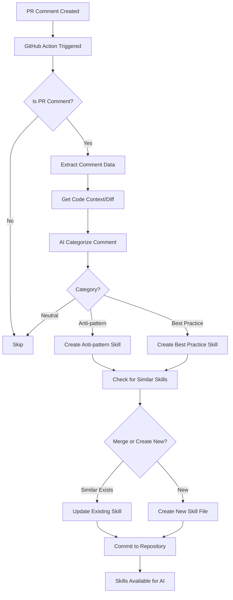

# PR Comment Skills Extractor - Implementation Plan

## Overview

This system will automatically extract knowledge from pull request review comments and convert them into Claude Code Skills files. The goal is to build a growing knowledge base from experienced reviewers' feedback, categorized into anti-patterns to avoid and best practices to follow.

## Architecture



## Components

### 1. GitHub Action Workflow

**File:** `.github/workflows/extract-pr-skills.yml`

- **Trigger:** `issue_comment` event (types: `created`, `edited`)
- **Filter:** Only process comments on pull requests (`github.event.issue.pull_request != null`)
- **Steps:**

  1. Checkout repository
  2. Extract comment metadata (body, author, file path, PR number)
  3. Fetch code context (diff hunk) using GitHub API
  4. Process comment with AI to categorize and extract insights
  5. Generate/update skill files
  6. Commit changes back to repository

### 2. Comment Processing Script

**File:** `scripts/process-comment.js` (or Python equivalent)

**Responsibilities:**

- Extract comment data from GitHub event payload
- Fetch associated code diff using GitHub API
- Use AI (via Cursor CLI or API) to:
  - Categorize comment (anti-pattern, best-practice, neutral)
  - Extract key insights and actionable guidance
  - Identify relevant code patterns
- Determine skill category and name
- Check for existing similar skills to avoid duplication

**Input:**

- Comment body
- File path
- Code diff hunk
- Comment author
- PR metadata

**Output:**

- Skill category (anti-pattern/best-practice)
- Skill name
- Skill content (instructions, examples)
- Code context

### 3. Skill File Generator

**File:** `scripts/generate-skill.js`

**Responsibilities:**

- Create/update skill files in `.claude/skills/` directory
- Structure skills with proper YAML frontmatter
- Organize by domain (OHIF, Cornerstone3D, general)
- Merge similar skills intelligently
- Maintain skill metadata (source comments, authors, dates)

**Skill Structure:**

```
.claude/skills/
  ├── ohif/
  │   ├── anti-patterns/
  │   │   ├── avoid-direct-viewport-manipulation/
  │   │   │   └── SKILL.md
  │   │   └── ...
  │   └── best-practices/
  │       └── ...
  ├── cornerstone3d/
  │   ├── anti-patterns/
  │   └── best-practices/
  └── general/
      ├── anti-patterns/
      └── best-practices/
```

### 4. Skill File Template

**Format:** Each skill follows Claude Skills structure:

````markdown
---
name: skill-name
description: Brief description of the skill
allowed-tools: Read, Grep, Glob, Write, Edit
---

# Skill Title

## Context
[Domain: OHIF/Cornerstone3D/General]

## Instructions
[Clear, actionable guidance extracted from review comments]

## Anti-Pattern / Best Practice
[What to avoid or what to do]

## Examples

### ❌ Bad
```code
[Example of bad code from review]
````

### ✅ Good

```code
[Example of good code from review]
```

## Source

- Extracted from PR #123 by @reviewer
- Related file: `path/to/file.ts`
- Date: 2024-01-15

```

## Implementation Details

### GitHub Action Configuration

**Key Features:**

- Use `issue_comment` event with filtering for PRs
- Access GitHub API using `GITHUB_TOKEN`
- Use Cursor CLI for AI processing (if available) or alternative AI service
- Store Cursor API key in GitHub Secrets
- Commit generated skills back to repository

**Permissions:**

- `contents: write` (to commit skill files)
- `pull-requests: read` (to read PR comments and diffs)

### AI Processing Strategy

**Categorization Logic:**

1. Analyze comment sentiment and keywords
2. Identify if comment suggests:

   - Something to avoid (anti-pattern)
   - Something to do (best practice)
   - General feedback (may not generate skill)

3. Extract actionable guidance
4. Identify code patterns and examples

**Deduplication:**

- Compare new skill against existing skills using semantic similarity
- Merge if similarity > threshold (e.g., 80%)
- Otherwise create new skill file

### Skill Organization

**Naming Convention:**

- Anti-patterns: `avoid-{pattern-description}`
- Best practices: `prefer-{pattern-description}` or `use-{pattern-description}`

**Domain Detection:**

- Analyze file paths and code context
- Categorize as OHIF, Cornerstone3D, or general
- Use keywords and file patterns to determine domain

## Files to Create

1. `.github/workflows/extract-pr-skills.yml` - Main workflow
2. `scripts/process-comment.js` - Comment processing logic
3. `scripts/generate-skill.js` - Skill file generation
4. `scripts/utils/github-api.js` - GitHub API helpers
5. `scripts/utils/skill-manager.js` - Skill file management
6. `scripts/utils/ai-processor.js` - AI categorization logic
7. `.claude/skills/.gitkeep` - Ensure skills directory exists
8. `README.md` - Documentation

## Configuration

**Required GitHub Secrets:**

- `CURSOR_API_KEY` (if using Cursor CLI)
- Or alternative AI service API key

**Optional Configuration:**

- Similarity threshold for skill merging
- Domains to track (OHIF, Cornerstone3D)
- File patterns for domain detection
- Skill categories to generate

## Future Enhancements

1. **Webhook Endpoint:** Alternative to GitHub Actions for more control
2. **Skill Review Process:** Manual approval before committing skills
3. **Skill Analytics:** Track which skills are most referenced
4. **Multi-Repository Support:** Aggregate skills from multiple repos
5. **Skill Expiration:** Archive outdated skills
6. **Reviewer Reputation:** Weight skills by reviewer experience/role

## Security Considerations

1. **Token Security:** Store API keys in GitHub Secrets
2. **Code Execution:** Limit permissions to read PRs and write to skills directory only
3. **Content Validation:** Sanitize AI-generated content before committing
4. **Rate Limiting:** Handle API rate limits gracefully
5. **Review Process:** Consider requiring PR approval for skill commits