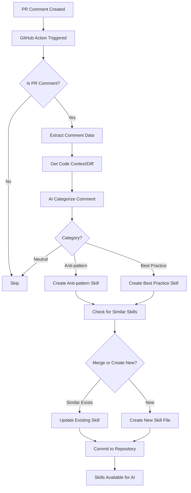

# PR Comment Skills Extractor

Automatically extract knowledge from pull request review comments and convert them into Claude Code Skills files. This builds a growing knowledge base from experienced reviewers' feedback, categorized into anti-patterns to avoid and best practices to follow.

**Now follows [Claude Skill authoring best practices](https://docs.anthropic.com/docs/en/agents-and-tools/agent-skills/authoring) for optimal AI discovery and usage.**

## Overview

This GitHub Action processes PR review comments to:
- Extract actionable insights from code review feedback
- Categorize comments as anti-patterns, best practices, or neutral
- Generate Claude Code Skills files organized by domain (OHIF, Cornerstone3D, general)
- Deduplicate and merge similar skills automatically
- Build a knowledge base that improves over time

### Best Practices Applied

Generated skills follow Claude's authoring best practices:

- **Gerund naming**: Skills use verb-ing form (e.g., `avoiding-direct-manipulation`)
- **Third-person descriptions**: Includes both what the skill does AND when to use it
- **Concise content**: Removes verbose explanations Claude doesn't need
- **Progressive disclosure**: Large skills split into SKILL.md + reference files
- **Line budget**: SKILL.md kept under 500 lines
- **No time-sensitive info**: Dates stored as metadata, not in main content
- **Validation feedback loop**: Built-in validator checks all best practices

## Architecture



## Setup

### 1. Install Dependencies

This action uses Node.js. The workflow will automatically install dependencies, but for local development:

```bash
npm install
```

### 2. Configure GitHub Secrets

Add the following secrets to your GitHub repository:

1. Go to **Settings** → **Secrets and variables** → **Actions**
2. Add a new repository secret:

   - **`CURSOR_API_KEY`** (optional but recommended): Your Cursor API key for AI processing
     - If not provided, the system will use a fallback keyword-based categorization
     - You can also use an OpenAI API key (it's OpenAI-compatible)

### 3. Workflow Permissions

The workflow requires the following permissions (already configured in the workflow file):
- `contents: write` - To commit skill files
- `pull-requests: read` - To read PR comments and diffs
- `issues: read` - To read issue/PR metadata

## How It Works

1. **Trigger**: The workflow triggers on `issue_comment` events (when comments are created or edited on pull requests)

2. **Filtering**: Only processes comments on pull requests (skips regular issue comments)

3. **Extraction**: 
   - Extracts comment body, author, file path, and PR metadata
   - Fetches code context (diff hunk) from GitHub API if available

4. **AI Processing**:
   - Uses AI to categorize the comment (anti-pattern, best-practice, or neutral)
   - Extracts actionable insights, examples, and guidance
   - Determines the domain (OHIF, Cornerstone3D, or general)

5. **Skill Generation**:
   - Checks for similar existing skills
   - Merges with existing skill if similarity > 80%
   - Creates new skill file if no similar skill exists
   - Organizes skills by domain and category

6. **Commit**: Automatically commits generated/updated skill files to the repository

## Skill File Structure

Skills are organized in `.claude/skills/` directory:

```
.claude/skills/
  ├── ohif/
  │   ├── anti-patterns/
  │   │   ├── avoid-direct-viewport-manipulation/
  │   │   │   └── SKILL.md
  │   │   └── ...
  │   └── best-practices/
  │       └── ...
  ├── cornerstone3d/
  │   ├── anti-patterns/
  │   └── best-practices/
  └── general/
      ├── anti-patterns/
      └── best-practices/
```

Each skill file follows the Claude Skills format with:
- YAML frontmatter (name, description, allowed-tools)
- Instructions extracted from review comments
- Examples (bad/good code patterns)
- Source attribution (PR number, author, date, file)

## Configuration

### Similarity Threshold

The default similarity threshold for merging skills is 80%. This can be adjusted in `scripts/utils/skill-manager.js`:

```javascript
this.similarityThreshold = 0.8; // Adjust as needed
```

### Domain Detection

The system automatically detects domains based on:
- File paths (e.g., files containing "ohif" or "cornerstone")
- Code context and keywords
- Comment content

You can customize domain detection logic in `scripts/utils/skill-manager.js` in the `detectDomain()` method.

### AI Provider

By default, the system tries to use Cursor API, then falls back to OpenAI-compatible API. You can configure this in `scripts/utils/ai-processor.js`.

## Usage

### Automatic Processing

The workflow runs automatically when:
- A new comment is created on a pull request
- An existing comment is edited on a pull request

### Manual Testing

To test locally, you can create a test event file:

```bash
# Create a test event file
cat > test-event.json << EOF
{
  "action": "created",
  "issue": {
    "number": 123,
    "pull_request": {}
  },
  "comment": {
    "id": 456,
    "body": "Avoid directly manipulating viewport state. Use the viewport service instead.",
    "user": {
      "login": "reviewer"
    },
    "path": "src/viewer/viewport.ts"
  },
  "repository": {
    "full_name": "owner/repo"
  }
}
EOF

# Set environment variables
export GITHUB_EVENT_PATH=test-event.json
export GITHUB_TOKEN=your_token_here
export CURSOR_API_KEY=your_key_here

# Run the script
node scripts/process-comment.js
```

## Skill Validation

Validate skills against best practices using the built-in validator:

```bash
# Validate all skills
npm run validate

# Validate a specific skill
node scripts/validate-skills.js .claude/skills/ohif/anti-patterns/avoiding-direct-viewport-manipulation/SKILL.md
```

The validator checks for:
- **Required fields**: name and description in frontmatter
- **Name format**: lowercase, hyphens, max 64 chars, gerund form
- **Description format**: third person, includes "when to use", max 1024 chars
- **Content length**: warns if over 500 lines
- **Conciseness**: flags verbose patterns
- **Time-sensitive info**: warns about date-dependent content
- **Reference depth**: ensures files are one level deep

## Example Skills

### Anti-Pattern Skill (Best Practices Format)

```markdown
---
name: avoiding-direct-viewport-manipulation
description: Prevents direct viewport state manipulation which causes sync issues. Use when reviewing or writing code that interacts with OHIF viewports.
---

# Avoiding Direct Viewport Manipulation

## Instructions

Use the viewport service instead of directly modifying viewport properties. Direct manipulation bypasses state management and causes synchronization issues.

## Anti-Pattern

Directly accessing viewport properties like `element.style` or `renderingEngineId` leads to inconsistent application state.

## Examples

### Bad

```
viewport.element.style.display = 'none';
viewport.renderingEngineId = newId;
```

### Good

```
viewportService.setViewportVisibility(viewport.id, false);
viewportService.updateViewport(viewport.id, { renderingEngineId: newId });
```

<!--
Source Metadata:
PR: #123
Author: @reviewer
File: src/viewer/viewport.ts
-->
```

**Key differences from old format:**
- Gerund name: `avoiding-` instead of `avoid-`
- Description includes "when to use"
- No `allowed-tools` (not required per best practices)
- No `## Context` section (domain in description)
- Source info in HTML comment (not time-sensitive)
- More concise instructions

## Troubleshooting

### Skills Not Being Generated

- Check that `CURSOR_API_KEY` is set correctly
- Verify the comment is on a pull request (not a regular issue)
- Check workflow logs for AI processing errors
- Ensure the comment contains actionable feedback (not just "LGTM" or similar)

### Skills Being Merged Incorrectly

- Adjust the similarity threshold in `skill-manager.js`
- Review the similarity calculation logic
- Check that skill names are being normalized correctly

### API Rate Limits

- The system includes basic error handling for rate limits
- Consider adding retry logic for production use
- Monitor GitHub API usage

## Contributing

Contributions are welcome! Please:
1. Test your changes locally
2. Ensure all scripts follow Node.js best practices
3. Update documentation as needed

## License

MIT
